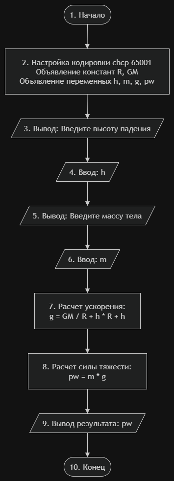

# Домашнее задание к работе 3

## Условие задачи
Написать и отладить программу вычисления силы тяжести при
падении с заданной высоты тела заданной массы.

## 1. Алгоритм и блок-схема

### Алгоритм
1. **Начало**
2. Подключить необходимые библиотеки и константы:
   - <locale.h> - для работы с локалью (поддержка русского языка).
   - <stdio.h> - для ввода/вывода данных (printf).
   - <stdlib.h> - стандартные функции библиотеки (в данном коде напрямую не используются, но подключены).
   - R - радиус Земли, равный (6371000) м.
   - GM - гравитация Земли, равная (3.986004418 * 10^14) м^3/с^2
3. Определить функцию main():
   - Изменить кодировку консоли на UTF-8 с помощью команды system("chcp 65001") для корректного отображения русского языка.
   - Объявить переменные типа float для хранения физических величин: h (высота падения), m (масса тела), g (ускорение свободного падения), pw (сила тяжести).
4. Ввести исходные данные:
   - Вывести на экран приглашение «Введите высоту падения (м):» с помощью функции puts.
   - Считать введенное пользователем значение высоты и записать в переменную h с помощью scanf_s.
   - Вывести на экран приглашение «Введите massu тела (кг):» с помощью функции puts.
   - Считать введенное пользователем значение массы и записать в переменную m с помощью scanf_s.
5. Произвести расчеты:
   - Вычислить ускорение свободного падения g на заданной высоте по формуле: g = GM / ((R + h) * (R + h)).
   - Вычислить силу тяжести pw по формуле: pw = m * g
6. Вывести результат:
   - Отобразить на экране значение силы тяжести в Ньютонах с округлением до двух знаков после запятой, используя
   printf("Сила тяжести равна: %.2f Н\n", pw).
7. Вернуть значение 0 (сигнал успешного завершения работы программы).
8. **Конец**

### Блок-схема
 

https://github.com/stzraw/lab-3-VSTU-HW/blob/main/lab_3HW_schema.png

## 2. Реализация программы

#include <locale.h>
#include <stdio.h>
#include <stdlib.h> 
#define      R       6371000.0f
#define      GM      3.986004418e14f

int main()
{
	system("chcp 65001");
    //setlocale(LC_CTYPE, "RUS");

    float h, m, g, pw;
	puts("Введите высоту падения (м):");
	scanf_s("%f", &h);

    puts("Введите массу тела (кг):");
	scanf_s("%f", &m);

    g = GM / ((R + h) * (R + h));
    pw = m * g;
    
	printf("Сила тяжести равна: %.2f Н\n", pw);
	return 0;
}

## 3. Результаты работы программы

при вводимых данных 10 и 10 вывод: **Сила тяжести равна: 98.20 Н**

## 4. Информация о разработчике

Быханов Александр Андреевич бИД - 262 2пг

